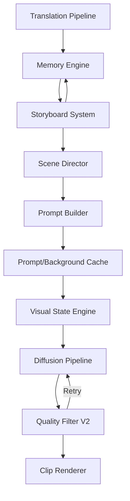

# Novel Video Factory V3 - Migration Plan

## 1. Executive Summary

This document outlines the migration strategy to evolve the Novel Video Factory from its current state (V2-equivalent modules integrated into the base project) into a robust, cinematic, and Kaggle-optimized V3 architecture. The goal is to dramatically improve character consistency, speed, scalability, and visual direction without breaking existing functional components.

## 2. Architecture Comparison

### Current Architecture (V1/V2 Base)
- **Memory Engine**: Single-layer character storage (`Character` model with static `visual_dna` and basic `dynamic_state`).
- **Visual Planning**: `ScenePlanner` extracts linear scenes directly into simple prompts.
- **Prompting**: `PromptGenerator` naively concatenates DNA and tags.
- **Rendering**: Global batching in `VideoRenderer` loading all prompts and generating images sequentially.
- **State Management**: Simple caching (`cache_manager.py`) at the pipeline stage level.

### Proposed Architecture (V3)
- **Memory Engine**: Multi-layered (Base DNA + CharacterState Overrides + LocationState).
- **Storyboard System**: Intermediate layer between memory and prompting. Scene planning produces structured cinematic data (Scene Director).
- **Prompting**: Visual State Engine merges DNA with state, Timeline, and Relationships before generating prompts.
- **Rendering**: Clip-based architecture. Renders isolated 10-minute clips to manage memory efficiently on Kaggle.
- **State Management**: Granular checkpointing (`project_state.json`) tracking at the clip/scene level. Persistent seeds and advanced Prompt Cache.
- **Execution**: Parallelized CPU (prompt prep) and GPU (inference) execution.

## 3. Dependency Graph Changes

**New Dependencies Required:**
- `opencv-python` / `dlib` / `mediapipe`: For Quality Filter V2 (Face detection, limb counting).
- `imagehash`: For duplicate detection in Quality Filter V2.
- `threading` / `multiprocessing` / `asyncio`: For CPU/GPU overlapping.

**Module Interactions:**

## 4. Conflicting Modules

- **`core/visual/prompter.py` vs Visual State Engine**: Current prompter manually fetches and injects DNA. This logic must be removed from the prompter and moved into the Memory Engine/Visual State Engine which outputs a single resolved profile.
- **`core/video/renderer.py` vs Clip Rendering**: Current renderer loops through all scenes in `prompts.json` in batches. This will be replaced by the `--clip` based localized renderer.
- **`core/visual/planner.py` vs Storyboard/Scene Director**: Planner currently outputs simple tags. It needs to be upgraded to output structured JSON matching the Scene Director specification.

## 5. Duplicate Code & Redundancy

- The logic for formatting character prompts is scattered in `extractor.py`, `prompter.py`, and `main.py` (character sheets). This should be unified inside the `VisualStateEngine`.
- Existing caching (`core/cache_manager.py`) may overlap with the new `project_state.json` checkpoint engine.

## 6. Migration Order (Incremental Strategy)

To ensure backward compatibility and continuous operation, the migration will be executed in the following phases:

### Phase 0: Data-Oriented Foundations (Highest Priority)
- **Asset Dependency Graph**: Core addition to track origin. Each generated file/scene knows its upstream dependencies (version, hash). Changing a CharacterState only invalidates dependent scenes, making the pipeline incremental.
- **Manifest System**: Introduce `manifest.json` at the project root for project metadata and `project_state.json` for pipeline execution state. Every stage reads this instead of scanning folders.
- **Canonical Scene Object**: Establish a single schema containing `scene_index`, `resolved_visual_state`, `camera`, `motion`, `status`, `prompt_hash`, `background_hash` and `quality_score` that every stage reads and updates.
- **Render Queue**: Implement `render_queue.db` in `output/` to track scene statuses (`pending`, `done`, `failed`, `rendering`, `retry`) for instant Kaggle crash recovery.
- **Artifact Versioning**: Implement `metadata.json` for storyboards, prompts, and memory to track active versions (`v1`, `v2`) instead of duplicating folders.
- **Project Locking**: Create `.lock` file to prevent concurrent Kaggle process corruption.

### Phase 1: Foundational Data Structures
- **Step 2**: Upgrade Character Memory system (`CharacterState` merging).
- **Step 3**: Extend CharacterState schema (age, outfit, etc.).
- **Step 10**: Location Engine upgrades.
- **Character Inheritance**: Evolve `base -> state -> resolved` logic in `VisualStateEngine`.

### Phase 2: Visual & Staging Logic
- **Step 9**: Visual State Engine (Resolving profiles).
- **Step 11**: Relationship Engine (Staging logic).
- **Step 12**: Timeline Engine (Event influence).
- **Scene Director Feature**: Upgrade `ScenePlanner` to output structured cinematic objects (camera, angle, emotion, etc.).

### Phase 3: Assets & Caching
- **Step 4**: Reference Image Manager (Pose generation).
- **Step 8**: Prompt Cache (Hashing mechanism).
- **Step 14**: Semantic Background Cache (Reusing backgrounds based on semantics, not just exact hashes).
- **Step 7**: Persistent Seeds.

### Phase 4: Pipeline Execution & Optimization
- **Immutable Storyboard System**: Generate `clipXX.json` and lock them.
- **Step 6**: Clip Rendering system & CLI updates.
- **Step 13**: Consistency Scoring & Quality Filter V2 (CLIP similarity for identity scores).
- **Step 16 & 17**: Kaggle Optimization & Parallel Execution.
- **Step 18**: Final Documentation.

## 7. Compatibility Risks

- **Database Migrations**: Altering SQLite schemas for `Character` and `Location` might crash if reading older project databases. We must use schema migration or fallback defaults.
- **CLI Flags**: We must maintain `--stage all`, `--stage visual` etc., while introducing `--clip`. We will route legacy commands to the new clip system seamlessly.
- **LLM Output Format**: Upgrading the `ScenePlanner` to output Scene Director JSON might cause formatting errors with `qwen2.5:7b`. Strict system prompting and validation layers are critical.
- **OOM during Image Generation**: Parallel execution must strictly isolate GPU loads to prevent PyTorch from OOMing on Kaggle's 16GB VRAM.

---
**Status**: Step 1 Complete. Ready for User Review before proceeding to Step 2.
